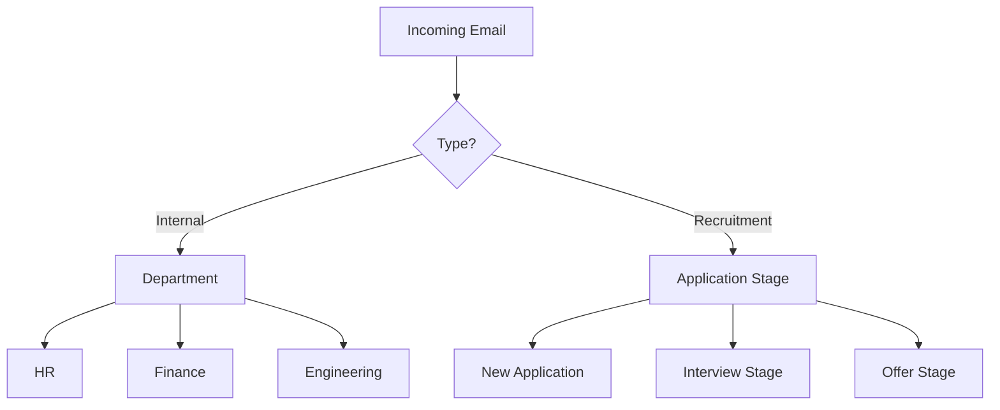

🧠 Smart HR Management System

The Smart HR Management System is a full-stack Streamlit-based application designed to streamline HR operations. It offers both employee and HR interfaces with advanced features like leave management and Gmail classification using AI.

🚀 Features

👤 Authentication System
-Sign Up and Login for both Employees and HRs
-Session-based user roles and access control

👨‍💼 Employee Dashboard
-Apply for leave
-Check leave status
-View leave history
-Resign from the company
-Classify Gmail inbox using AI
-Log out

🧑‍💼 HR Dashboard
-View pending leave requests
-Approve or reject leave applications
-View employee details
-Classify Gmail inbox using AI
-Log out

🤖 Gmail Classification Feature
-Uses Gemini API to classify emails into:
-Urgent
-General
-Promotional
-Fetches emails using Gmail API
-Integrated in both Employee and HR dashboards

🔧 Tech Stack
-Frontend & Backend: Streamlit (Python)
-Database: MySQL
-Email Reading: Gmail API
-Email Classification: Gemini API


## 🚧 Implementation Progress

### ✅ Completed (v1.0)
- Basic authentication system (login/signup) with OTP verification
- Employee and HR dashboards with role-based access
- Leave management system (request, approve, reject, track)
- Gmail API integration with OAuth 2.0
- Email classification into: Important, General, and Spam
- Secure environment configuration

NOW-
#### Smart Email Classification 2.0
- **Two-tier Email Categorization**:
  - **Type 1: Internal Communications**
    - Emails from current employees
    - Department-wise filtering
    - Priority tagging based on sender role/importance
  
  - **Type 2: Recruitment Pipeline**
    - Automated parsing of job applications
    - Resume/CV analysis and extraction
    - Skills matching against job requirements
    - Automatic ranking of candidates

#### Advanced Features
- **Resume Parser**:
  - Extract skills, experience, and education
  - Match against job descriptions
  - Automatic scoring of applicants
  
- **Smart Filters**:
  - Custom keyword-based filtering
  - Experience level matching
  - Skill gap analysis
  - Location and availability matching

- **Automated Workflow**:
  - Auto-responders for applications
  - Interview scheduling
  - Status updates for applicants
  - Integration with calendar apps
### 🚀 Upcoming Features (v2.0)

#### 📊 Enhanced Email Management Dashboard
```
┌─────────────────────────────────────────────────┐
│  🔍 EMAIL INTELLIGENCE DASHBOARD               │
├───────────────────┬───────────────────────────┐
│  📥 Inbox (42)    │  📊 Analytics             │
│  📤 Sent          │  ┌─────────────────────┐  │
│  📎 Attachments   │  │  Urgent: 12         │  │
│  🗑️ Trash         │  │  Important: 18      │  │
│  ⭐ Starred       │  │  Pending Review: 8   │  │
└───────────────────┴───────────────────────────┘
```

#### 🏷️ Smart Email Categorization



##### 📌 Priority Matrix
| Urgency \ Importance | High                    | Medium                | Low                 |
|----------------------|-------------------------|----------------------|---------------------|
| **High**            | 🔴 Immediate Response  | 🟡 Schedule Review   | 🟢 Read When Free   |
| **Medium**           | 🟠 Today               | 🟢 This Week         | ⚪ Low Priority    |
| **Low**              | 🟢 This Week           | ⚪ When Possible     | ⚪ Archive         |

#### 🔍 Advanced Email Processing

```
📂 HR Emails
├── 📁 Recruitment
│   ├── 🟢 New Applications (5)
│   ├── 🟡 Interview Stage (3)
│   └── 🔴 Offers Pending (2)
├── 📁 Employee Relations
│   ├── 🟠 Grievances (3)
│   └── 🟢 General (8)
└── 📁 Compliance
    └── ⚠️ Action Required (2)
```

### 📅 Future Roadmap (v3.0+)
- AI-powered candidate matching
- Video interview integration
- Automated skill assessments
- Team collaboration tools
- Advanced analytics dashboard
- Mobile application 


#### 🤖 Smart Features
- **AI-Powered Inbox**
  - 🎯 Priority Inbox with smart sorting
  - 🔄 Auto-categorization of emails
  - 📅 Smart scheduling suggestions
  - 📝 Auto-generated response drafts

- **Recruitment Assistant**
  - 📄 Resume parsing & scoring
  - 🎯 Candidate matching algorithm
  - 📅 Automated interview scheduling
  - 🔄 Status tracking

- **Compliance & Security**
  - 🔒 End-to-end encryption
  - 📜 Audit trail
  - 🛡️ Data leak prevention
  - 👥 Role-based access

#### Security & Compliance
- End-to-end encryption for sensitive data
- GDPR/CCPA compliance features
- Audit logging for all actions
- Role-based access controls


## 🚀 How to Run Locally

1. **Clone the repository**
   ```bash
   git clone <your-repo-link>
   cd Smart-HR-Management-System
   ```

2. **Set up Python environment and install dependencies**
   ```bash
   python -m venv venv
   source venv/bin/activate  # On Windows: venv\Scripts\activate
   pip install -r requirements.txt
   ```

3. **Set up environment variables**
   Create a `.env` file in the root directory with:
   ```
   # Database Configuration
   DB_HOST=localhost
   DB_USER=your_username
   DB_PASSWORD=your_password
   DB_NAME=hr_management
   
   # Email Configuration
   EMAIL_SENDER=your_email@gmail.com
   EMAIL_PASSWORD=your_app_password
   SMTP_SERVER=smtp.gmail.com
   SMTP_PORT=587
   ```

4. **Set up Gmail API (Development)**
   - Enable Gmail API in [Google Cloud Console](https://console.cloud.google.com/)
   - Configure OAuth consent screen
   - Create OAuth 2.0 credentials
   - Download credentials as `credentials.json` to the project root

## 🔒 Production Deployment

### Gmail API Production Verification
Before deploying to production, complete Google's OAuth verification process:

1. **Prepare Required Documents**
   - App home page URL
   - Privacy policy URL
   - Terms of service URL
   - Detailed explanation of why you need each permission

2. **Submit for Verification**
   - Go to [Google Cloud Console](https://console.cloud.google.com/)
   - Select your project
   - Navigate to "APIs & Services" > "OAuth consent screen"
   - Click "Submit for verification"
   - Complete all required fields and submit

3. **Post-Verification**
   - Google will review your application (takes 3-7 business days)
   - Once approved, your app will be marked as verified
   - Update your app's OAuth consent screen with any requested changes

### Security Considerations
- Never commit sensitive information to version control
- Use environment variables for all credentials
- Implement proper error handling and logging
- Regularly update dependencies
- Monitor API usage and set up alerts

## 📁 Project Structure
📁 Project Structure

HR_management/
├── main.py
├── db.py
├── gmail_reader.py
├── email_classifier.py
├── leave_employee.py
├── leave_hr.py
├── login.py
├── signup.py
├── logout.py
└── requirements.txt


🙋‍♂️ Made By
Mukul Prasad
